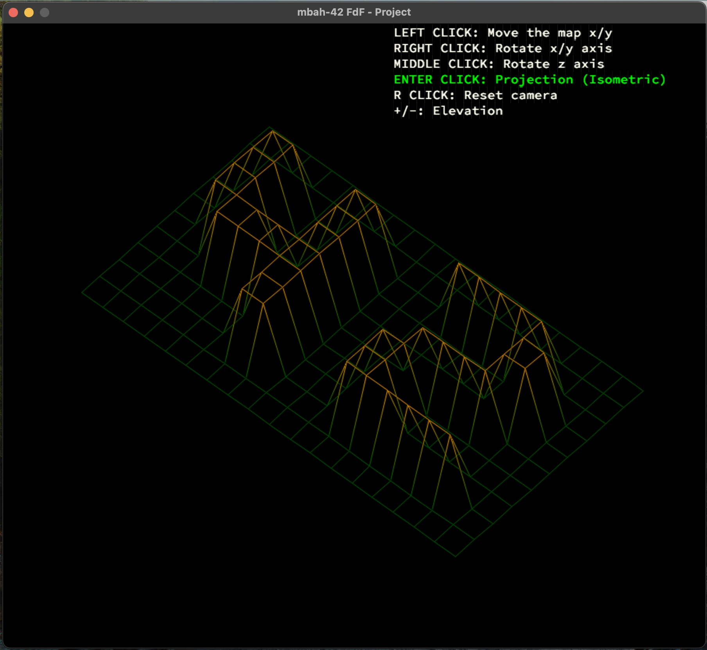
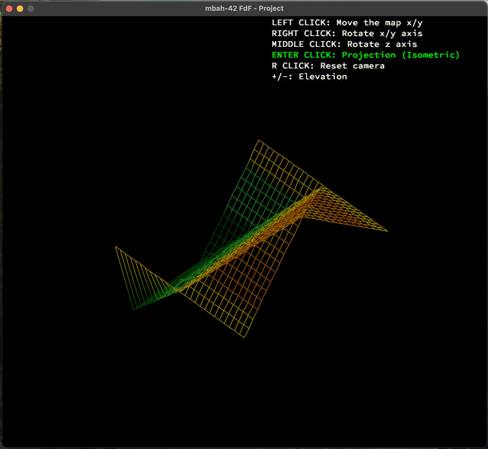

# 📈 Projet FdF

<p align="center">
  
</p>

Par Mbah, étudiant à 42 Lyon

## 🌟 Introduction

Bienvenue dans le projet **FdF** (Fil de Fer). Ce projet consiste à créer un programme capable de représenter des cartes en 3D en utilisant la perspective isométrique.

## 🔧 Fonctionnalités

- Affichage de cartes en 3D avec rotation, zoom, et translation.
- Gestion de différents types de projections : isométrique, parallèle, etc.
- Support pour différents types de fichiers de données pour les cartes.

## 📚 Prérequis

- Système d'exploitation : Linux ou macOS
- Langage de programmation : C
- Librairie graphique : [MiniLibX](https://www.mlx.org/)

## 🚀 Installation

1. Clonez le dépôt :
   ```bash
   git clone https://github.com/mbah24-dev/FdF.git
   ```
2. Accédez au répertoire du projet :
   ```bash
   cd FdF
   ```
3. Compilez le projet :
   ```bash
   make
   ```
4. Exécutez le programme :
   ```bash
   ./fdf [chemin_du_fichier]
   
   	exemple: ./fdf public/maps/pyra.fdf
   ```

# 🚀 Contrôles du jeu

Prêt à explorer ton monde en 3D ? Voici comment prendre le contrôle avec des touches et des mouvements stylés ! 😎

### 🧭 **Déplacements** (Flèches)
- **Flèche droite →** : Déplace la carte vers la droite. 🏃‍♂️
- **Flèche gauche ←** : Déplace la carte vers la gauche. 🏃‍♀️
- **Flèche haut ↑** : Déplace la carte vers le haut. ⬆️
- **Flèche bas ↓** : Déplace la carte vers le bas. ⬇️

### 🏞️ **Contrôles d'élévation (Agrandir l'axe Z)**
- **`+`** : Augmente l'élévation de la carte (agrandit l'axe Z). ⛰️🔝
- **`-`** : Réduit l'élévation de la carte (réduit l'axe Z). 🌄🔽

### 🌐 **Vues**
- **`Enter`** : Change entre la vue **iso** 🌍 et la vue **parallèle** 🗺️. (Toggle bouton 🔄)

### 🖱️ **Souris**
- **Clic gauche 🖱️ (maintenir)** : Déplace la carte sur l'axe XY. ✨
- **Clic droit 🖱️ (maintenir)** : Rotation de la carte autour de l'axe X et Y. 🔄🌀
- **Clic du milieu 🖱️** : Rotation de la carte autour de l'axe Z. 🔁

### 🚪 **Quitter le programme**
- **`ESC`** : Quitte le programme (si tu veux prendre une pause ou partir à l'aventure ailleurs 🚶‍♂️💨).

### 🎉 **Amuse-toi !**
Maintenant que tu connais toutes les commandes, il ne te reste plus qu'à explorer et t'amuser à fond ! 🎮🎉


## 🎨 **Captures d'écran** 📸✨

Voici quelques **captures d'écran** pour vous donner un aperçu de mon programme en action. Regardez comment il brille! 🌟

🎉 **Regardez ici** pour un **beau rendu** :

  
*Quand la magie opère ! ✨*

Et maintenant, une **vue spectaculaire** ! 🌋🔥

  
*Un peu de pyra pour votre journée ! 😎*

**Note**: Ces images sont en plein **action**, soyez prêts à être éblouis ! 💥✨
## 🚫 **Tricherie? Pas ici!** 🚫

L'intégrité est essentielle. Ce projet a été réalisé avec **passion**, **persévérance**, et **sueur** 😅. Je tiens à souligner que toute forme de triche ou de copier-coller sera **fermement désapprouvée**. Non seulement cela nuit à votre apprentissage, mais c'est aussi un coup de pied à l'esprit de la communauté 42! 💪

Alors, faites-le à **votre façon**, apprenez et brillez comme vous le méritez! ✨

> "Le succès vient de l'effort honnête, pas de raccourcis!" 💡


## 📝 Licence

Ce projet est sous licence MIT. Consultez le fichier `LICENSE` pour plus de détails.

## 👨‍💻 Auteur

Mbah - Étudiant à 42 Lyon  
Contact : [mbah@student.42lyon.fr](mbah@student.42lyon.fr)
